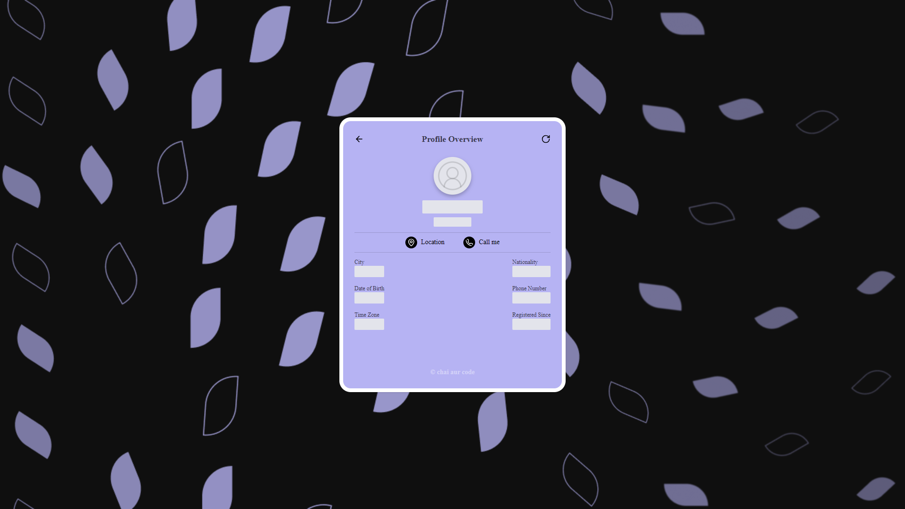
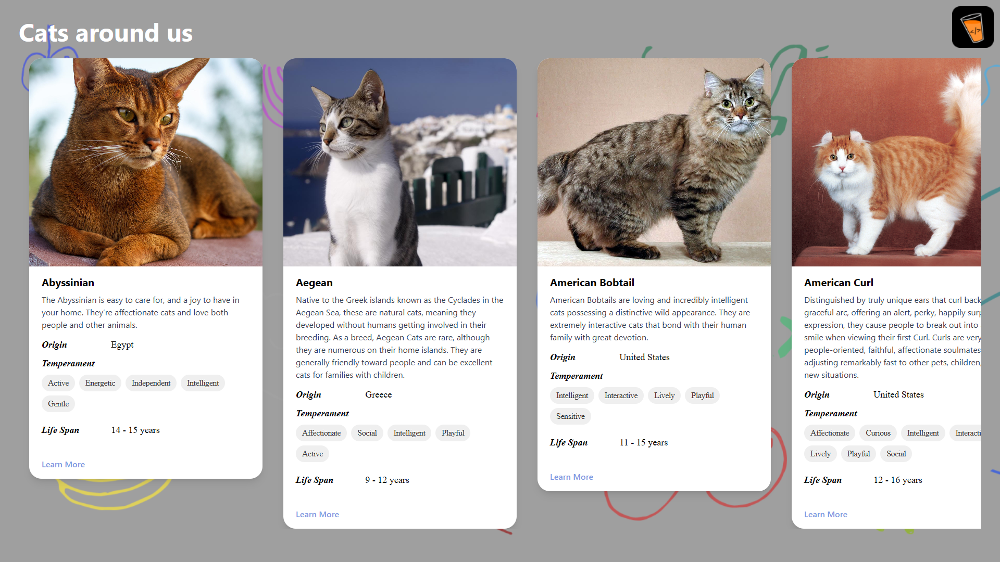
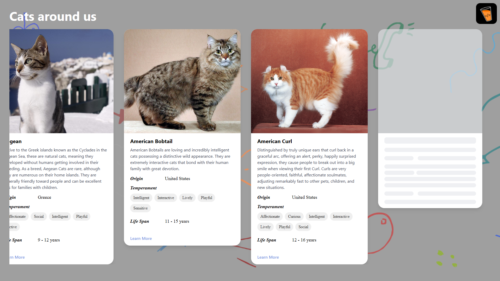

# React MasterJi Assignment [ COMPLETED 🎉 ]

An React Assignment by [chaicode.com](https://chaicode.com)

## Pages Folder

- These are the files that are main pages and rendering the Components on Routing
  - Cat Listing Page
  - Random Joke Page
  - Random User Page

## API Folder

- This is the folder that contains the functions that will fetch the data from the API
  - getCatsLists.js
  - getRandomJoke.js
  - getRandomUser.js

## Components Folder

- This Folder Contains the components
  - Cat Card
  - Cat Skeleton Card
  - Joke Card
  - User Card

## assets Folder

- This Folder Contains the Images/icons that are being used

## Screenshots

- User Profile Page
  

- User Profile Page with Loading Status
  

- Random Jokes Page

- Random Jokes Page with Loading Status

- Cat Listing Page

- Cat Listing Page with Loading Status

